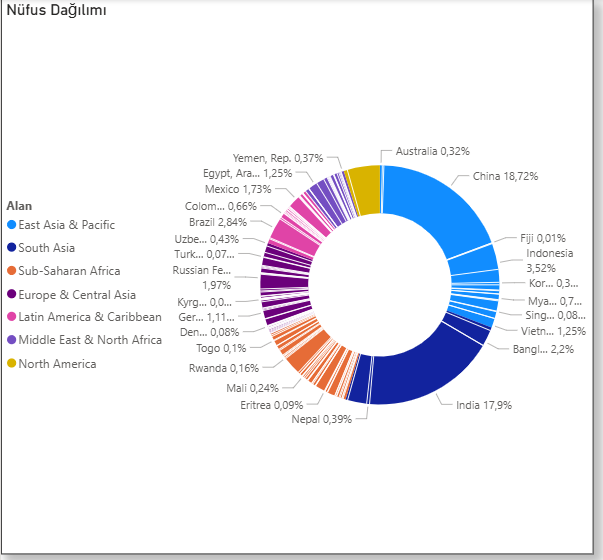

# 🌍 Power BI Regional Population Analysis

A data visualization project using Power BI, analyzing world population distribution by region using a donut chart.

## 📊 Project Overview

This project demonstrates how to import data, rename columns, and build a fully formatted donut chart in Power BI Desktop. The visualization breaks down global population by world region, with drill-down capability at the country level.

## 🗂️ Dataset

| File | Description |
|------|-------------|
| `Populations.xlsx` | World population data by region and country name |

## 🛠️ Steps Performed

### 1. Data Import
- Imported `Populations.xlsx` into a new Power BI Desktop report

### 2. Data Preparation
- Renamed the `Country` column to **Alan** (this column represents world regions, not individual countries)

### 3. Visualization
- Built a **Donut Chart** visual with the following fields:
  - Legend: Alan (region)
  - Values: Sum of Population
  - Details: Country Name (enables drill-down by country within each region)

### 4. Formatting
- Moved the legend to the **left**
- Added a custom **title**: Nüfus Dağılımı
- Customized **detail labels**:
  - Display units: Billions → **Millions**
  - Label contents: **Category, percent of total**
- Added a **border** and **shadow** to the visual

### 5. Save
- Saved the report as **Population**

## 📈 Key Insights

- **East Asia & Pacific** holds the largest share of world population (~30%)
- **South Asia** follows as the second most populated region (~18%)
- **Sub-Saharan Africa** ranks third (~17%)
- **North America** represents a relatively small share despite its economic size (~5%)

## 🖼️ Preview

## 🧰 Tools Used

- Microsoft Power BI Desktop
- Excel (.xlsx)
